Automated Performance Testing with Jenkins pipelines
====================================================


**Jenkins**

Load Impact integrates nicely with Jenkins pipelines, a leading continuous delivery and integration automation platform. Using our robust and extensible APIs you can integrate Load Impact’s world-leading performance testing platform into your automated Jenkins pipeline build and test process.

Load Impact covers your back with everything you need for Web, API and application performance testing. And test scripting is simple.

To get started, try this sample of how to include performance testing in your Jenkins Pipeline setup.

Continuous Delivery. Continuous performance feedback. Simple.
-------------------------------------------------------------

This sample assumes you are familiar with [Jenkins](https://jenkins.io). We set up a new pipeline and use the Blue Ocean UI to run because it looks nice.

Is also assumes you have a Load Impact account. [If not, go get one – it’s free](http://loadimpact.com).

We created a Jenkins pipeline by the name LI\_Pipeline\_Demo\_1

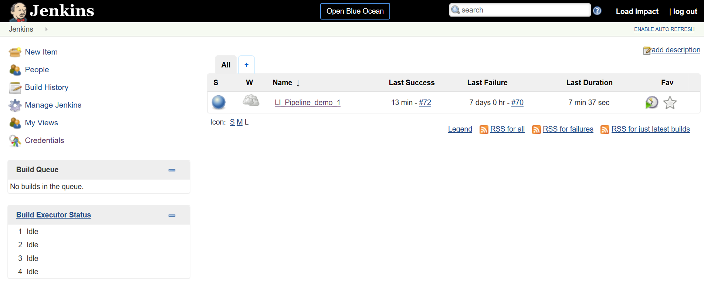

And here it is when we have executed a couple of times.

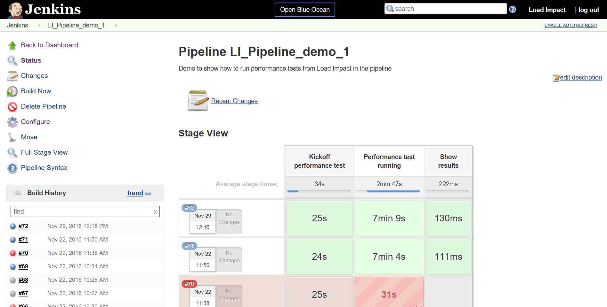

So slightly more interesting – let’s take a look at the Configuration of the pipeline.

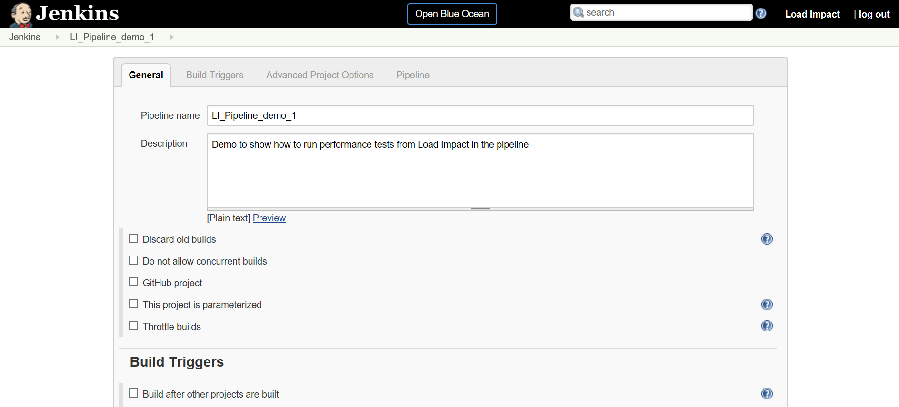

We just set up a pipeline that only executes a performance test so you can include it as you wish in your pipeline. There is nothing else in this demo.

All the good stuff is in the Pipeline so let’s go there and take a look

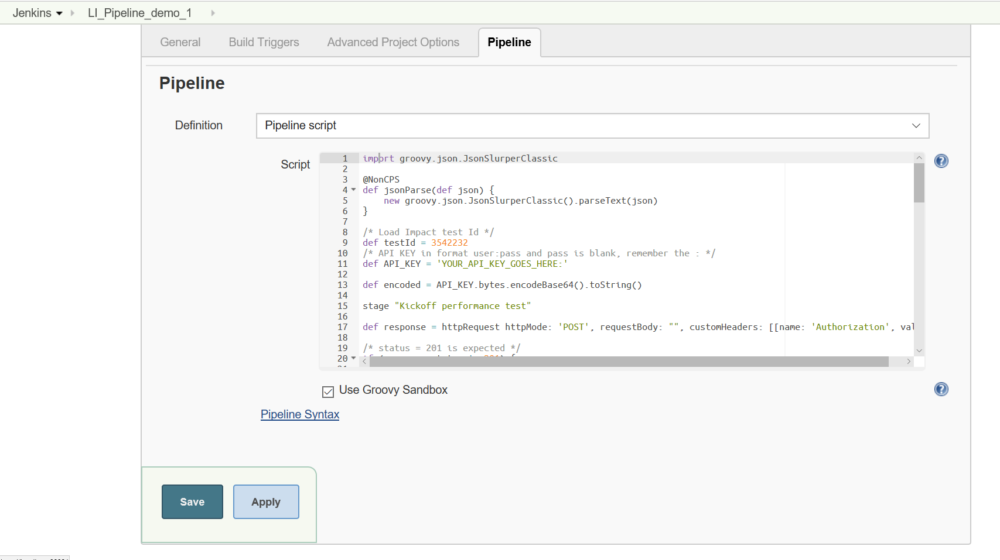

It’s all in the Groovy script for the pipeline so we will take a look at what it does in some detail.

You can get the code at github &lt;TBD TBD&gt; where it is shared.

Before we dive into the details – let’s get some essentials from your Load Impact account. We need the API key so you can access the API and a test to run.

The API key you get in your Load Impact account when you are logged in

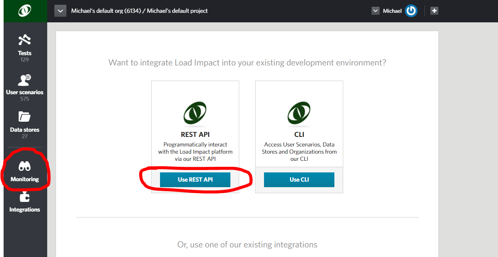

Go to “Monitoring” on the left and click “Use REST API”.

Then copy it from the yellow text box.

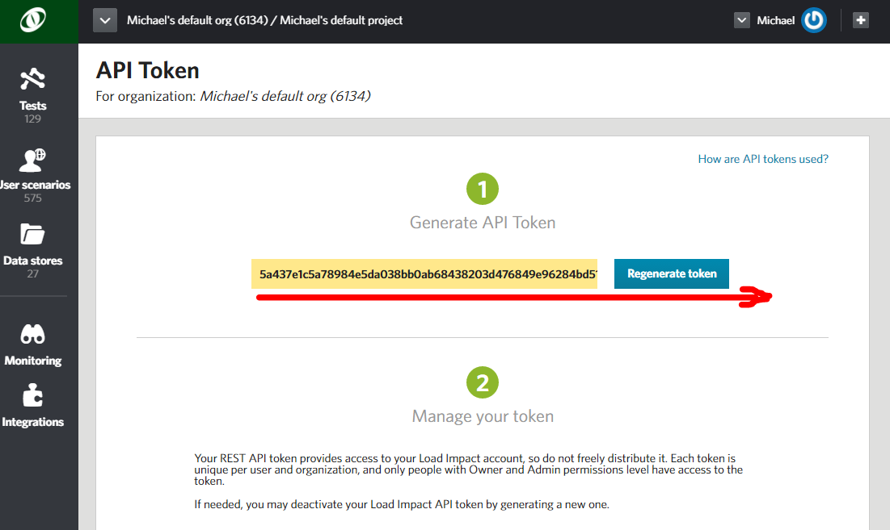

Just note that the API token is *longer* than the size of the box so make sure you get all of it!

Now you need to know which test to run. You can list your test configurations using the API or the CLI if you want to but the simplest way is to open it directly in your account and copy the id from the URL. Underlined in red.

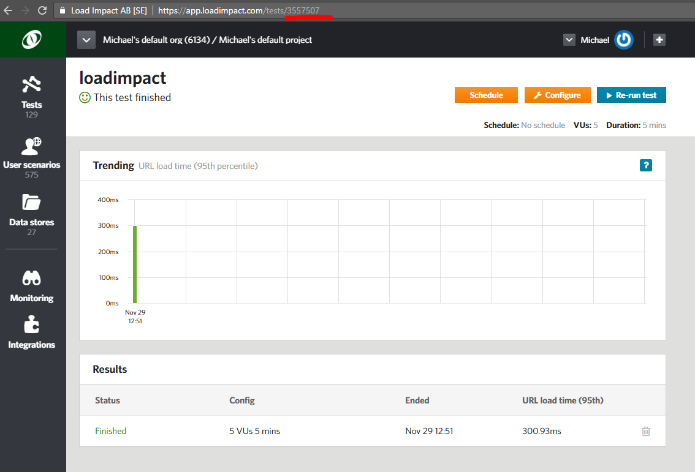

So now you have a test id for the test you want to run in your build pipeline and your API key.

All of the code is shared at Github for your download &lt;TBD TBD&gt;

The code has four parts, the initial and then three stages “Kickoff performance test”, “Performance test running” and “Show results”. If you are familiar with Jenkins pipelines you know the stages will be visible in Jenkins when you execute your pipeline including your Load Impact performance test.

The initial part of the pipeline code is where you set the test id and the API key.

```groovy
import groovy.json.JsonSlurperClassic 

@NonCPS
def jsonParse(def json) {
    new groovy.json.JsonSlurperClassic().parseText(json)
}

/* Load Impact test Id */
def testId = YOUR_TEST_ID_GOES_HERE
/* API KEY in format user:pass and pass is blank, remember the : */
def API_KEY = 'YOUR_API_KEY_GOES_HERE:'

def encoded = API_KEY.bytes.encodeBase64().toString()
```

So replace “YOUR\_TEST\_ID\_GOES\_HERE” with your test id, just the number – not a string.

And replace “YOUR\_API\_KEY\_GOES\_HERE” with your API key. Keep inside the quotes (it is a string) and remember to keep the ‘**:**’ at the end. It is basic AUTH, the username is the API key with a blank password. You could of course user the Jenkins Credentials store for this and get the value from the Credentials Store but that is outside the scope of this sample.

What else is there? We import some stuff to help in handling the json responses from the API when we use it. And at the end of the initial section the API key is encoded so it can be used in calling the API.

```groovy
stage "Kickoff performance test"

def response = httpRequest httpMode: 'POST', requestBody: "", customHeaders: [[name: 'Authorization', value: 'Basic ' + encoded]], url: 'https://api.loadimpact.com/v2/test-configs/' + testId + '/start'

/* status = 201 is expected */
if (response.status != 201) {
  exit ("Could not start test " + testId + ": " + response.status + "\n" + response.content)
}

def jid = jsonParse(response.content)
def tid = jid["id"]

timeout (time:5, unit: "MINUTES")
{
  waitUntil {
    /* waitUntil needs to slow down */
    sleep (time: 10, unit: "SECONDS")
    
    def r = httpRequest httpMode: 'GET', customHeaders: [[name: 'Authorization', value: 'Basic ' + encoded]], url: 'https://api.loadimpact.com/v2/tests/'+ tid + '/'
    def j = jsonParse(r.content)
    echo "status: " + j["status_text"]
    return (j["status_text"] == "Running");
  }    
}
```

At the “Kickoff performance test” stage we start by calling the [API to start a test](http://developers.loadimpact.com/api/#post-test-configs-id-start).

We check the response and if it fails for some reason we just exit which will fail the build step in the pipeline.

Parse the response and extract the running test id.

Then we let it take a maximum of five minutes for the test to actually kickoff. Since it can take Load Impact a couple of minutes to acquire and allocate all the resources (mainly load agents) needed we take some time to let the test reach the status of “Running”. The bigger the test, the more resources needed and the longer it can take. But remember, it’s a couple of minutes.

Slowing down the wait is accomplished by simple sleeping 10 seconds between iterations.

We get that status of the test by [calling the API](http://developers.loadimpact.com/api/#get-tests-id) and parsing the json response to check for the status in the response.

```groovy
stage "Performance test running"

/*
get and tell percentage completed
*/
maxVULoadTime = 0.0
sVUL = 0
valu = 0.0
waitUntil {
  /* No need to get state of test run as often */
  sleep (time: 30, unit: "SECONDS")

  /* Get percent completed */    
  def r = httpRequest httpMode: 'GET', customHeaders: [[name: 'Authorization', value: 'Basic ' + encoded]], url: 'https://api.loadimpact.com/v2/tests/' + tid + '/results?ids=__li_progress_percent_total'
  def j = jsonParse(r.content)
  def size = j["__li_progress_percent_total"].size()
  def last = j["__li_progress_percent_total"]
  echo "percentage completed: " + last[size - 1]["value"]

  /* Get vu load time */
  r = httpRequest httpMode: 'GET', customHeaders: [[name: 'Authorization', value: 'Basic ' + encoded]], url: 'https://api.loadimpact.com/v2/tests/' + tid + '/results?ids=__li_user_load_time'
  j = jsonParse(r.content)

  sVUL = j["__li_user_load_time"].size()
  
  if (sVUL > 0) {
    echo "last: " + j["__li_user_load_time"][sVUL - 1]["value"]
      /* set max vu load time */
    valu = j["__li_user_load_time"][sVUL - 1]["value"]
    if (valu > maxVULoadTime) {
      maxVULoadTime = valu
    }

    /* check if VU Load Time > 1000 msec */
    /* It will fail the build */
    if (maxVULoadTime > 1000) {
     exit ("VU Load Time extended limit of 1 sec: " + maxVULoadTime)
    }
  }

  return (last[size - 1]["value"] == 100);
}
```

So now the test is running and we have reached the stage of “Performance test running”.

This time we wait until the test has completed, reached the percentage completed value of 100% with a slightly longer sleep between refreshing the status.

We do this by calling the [API for results](http://developers.loadimpact.com/api/#get-tests-id-results) and only requesting the percentage completed. The API returns all of the relevant data so we do some json parsing and just get the last percentage value from the result set.

All the results are available from the API so you can either use them or calculate new aggregate results to use as test thresholds for your pipeline test results.

We included an example of making a threshold from the [VU Load Time (please read the explanation of this value before using it)](http://support.loadimpact.com/knowledgebase/articles/174121-how-do-i-interpret-test-results).

We get the value by calling the same API as before but for the VU Load Time result, parse the json and for simplicity just get the last value (probably not the actual maximum since we would have needed to check all samples for that) and save the max of the last value and current max.

If the value exceeds 1 second we exit the build step and fail the build in this example. The test however will continue to run so a useful addendum to the code could be to abort the test run at this time.

```groovy
stage "Show results"
echo "Max VU Load Time: " + maxVULoadTime
```

Final stage “Show results” we just output the max VU Load Time. It can of course be any result but as a sample. You can of course use this result to decide on further actions in your pipeline.

Before you can run this piece of Groovy code in your pipeline you have to do In-process script approval in Jenkins for

```groovy
method groovy.json.JsonSlurperClassic parseText java.lang.String
method java.lang.String getBytes
new groovy.json.JsonSlurperClassic
staticMethod org.codehaus.groovy.runtime.EncodingGroovyMethods encodeBase64 byte[]
```

Finally, we can look at executing the pipeline in Jenkins and just because it looks good, we’ll use [Blue Ocean](https://jenkins.io/projects/blueocean/).

In the dashboard we only have a single pipeline for the purposes of this demo.

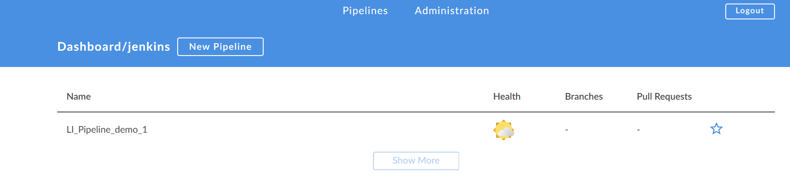

Open it.

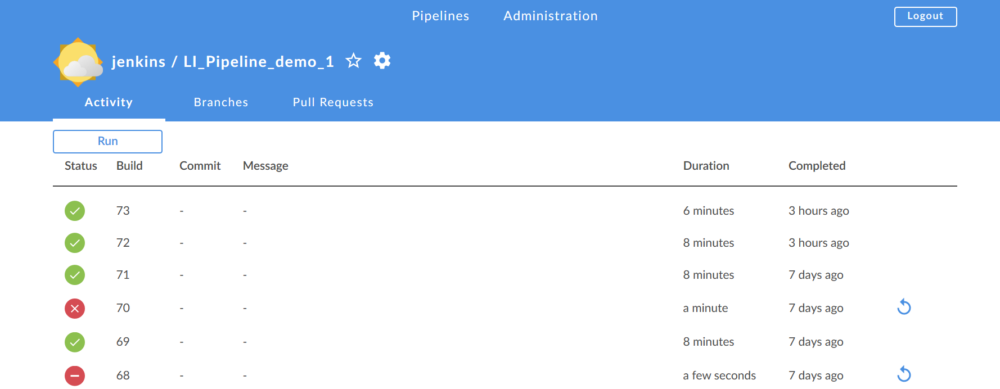

And run. Open the running pipeline.


Once it moves into running state it looks like this

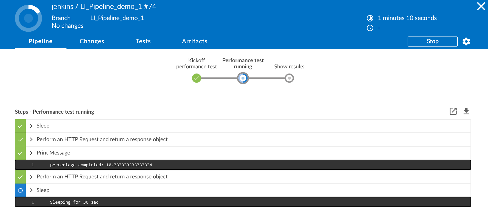

Final stage – Show results.

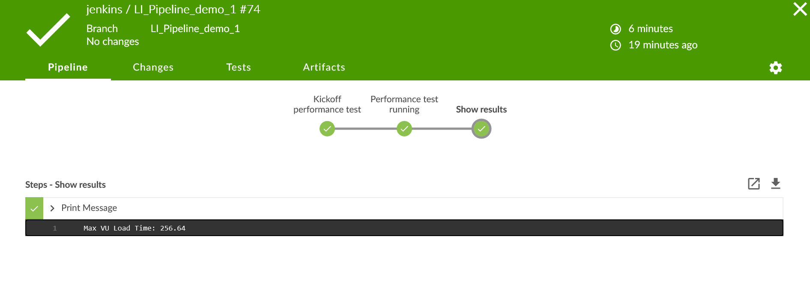

You can add/update/delete tests, user scenarios and data stores using the API and CLI, even stick all of it in your SCM of choice and let all of it be part of your build pipeline.

To dive deeper into using Load Impact from your CI/CD process (or for that matter any external usage) see our [*comprehensive API reference*](http://developers.loadimpact.com/api/) and the accompanying [*CLI*](http://support.loadimpact.com/knowledgebase/articles/833856-automating-load-testing-with-the-load-impact-api).


